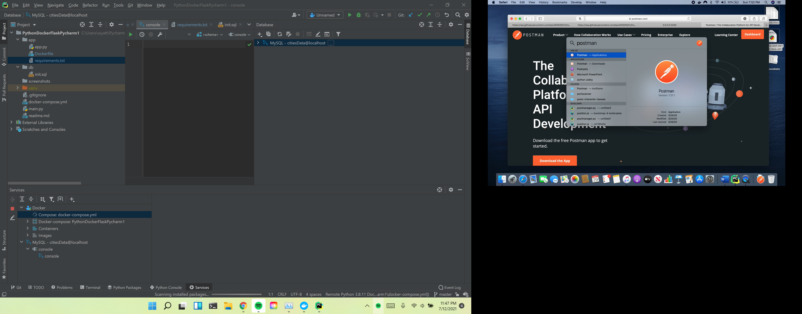
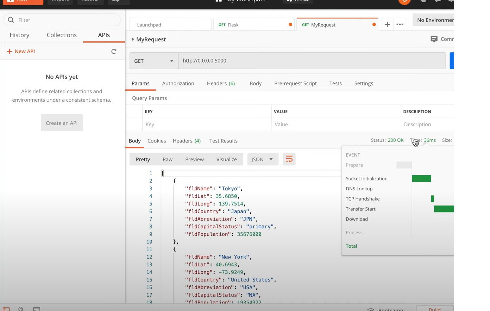

# Project Description
This project is a homework assignment to teach how to get Pycharm setup with Docker, Flask, MySQL, and Postman

Scroll below to see the database viewed in Pycharm and the POSTMAN results

